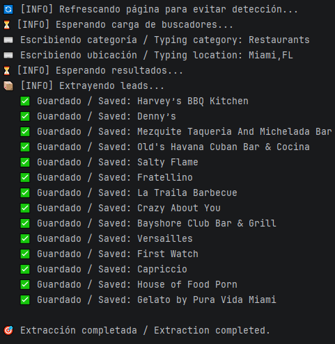
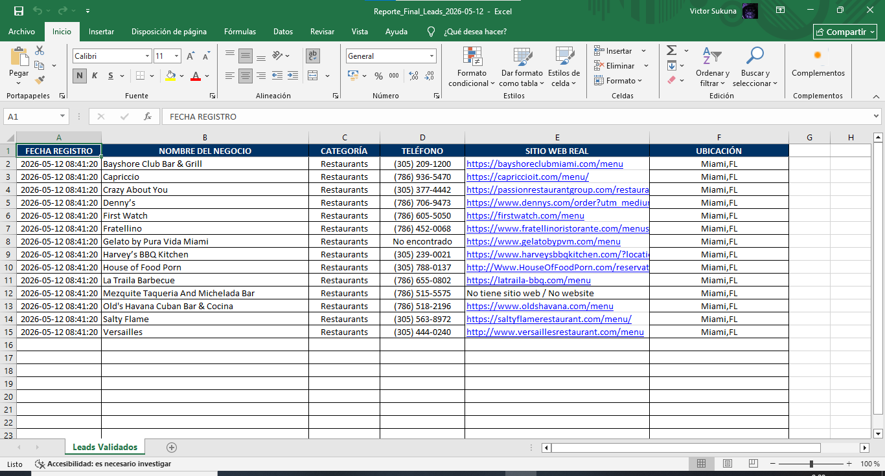
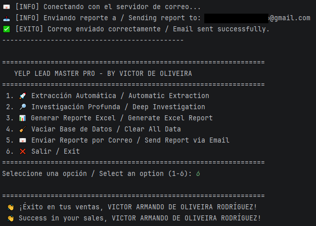

# 🚀 Yelp Lead Master Pro

  <a href="#-español">🇪🇸 Español</a> | <a href="#-english">🇺🇸 English</a> 

---

## 🇪🇸 Español

### 📌 Descripción
Yelp Lead Master Pro es una solución avanzada de automatización para la extracción y enriquecimiento de prospectos comerciales (leads). Desarrollado en Python, el sistema utiliza técnicas de Web Scraping para identificar negocios, validar su información de contacto y generar bases de datos listas para campañas de ventas.

### ⚙️ Funcionalidades
* 🚀 **Extracción Automática:** Captura masiva de negocios por categoría y ubicación.
* 🔎 **Investigación Profunda:** Enriquecimiento de leads mediante navegación automática para obtener sitios web y teléfonos reales.
* 📊 **Gestión de Datos:** Almacenamiento robusto en SQLite con limpieza automática de duplicados.
* 📧 **Notificación Inteligente:** Generación de reportes Excel profesionales y envío automático vía SMTP.

### 🧠 Arquitectura del Software
* `main.py`: Orquestador principal y panel de control bilingüe.
* `src/engine/`: Motores de scraping (Yelp Engine).
* `src/manager/`: Lógica de base de datos (SQLite).
* `src/tools/`: Módulos de notificación y herramientas de soporte.

### 📦 Instalación
1. `git clone https://github.com/victor-veira-py/Yelp_Lead_Master_Pro.git`
2. `cd Yelp_Lead_Master_Pro`
3. `pip install selenium pandas xlsxwriter python-dotenv`

### 🚀 Uso
1. Configura tus credenciales de correo en el archivo `.env`.
2. Ejecuta el sistema: `python main.py`.
3. Selecciona la opción deseada en el menú bilingüe.

### 📸 Resultados
📊 **Proceso de Extracción:**

📄 **Reporte Excel Empresarial:**

✅ **Envío de Notificación:**

---

## 🇺🇸 English

### 📌 Description
Yelp Lead Master Pro is an advanced automation solution for extracting and enriching business leads. Developed in Python, the system uses Web Scraping techniques to identify businesses, validate their contact information, and generate databases ready for sales campaigns.

### ⚙️ Features
* 🚀 **Automatic Extraction:** Mass capture of businesses by category and location.
* 🔎 **Deep Investigation:** Lead enrichment through automated navigation to obtain real websites and phone numbers.
* 📊 **Data Management:** Robust SQLite storage with automatic duplicate cleanup.
* 📧 **Intelligent Notification:** Professional Excel report generation and automatic delivery via SMTP.

### 🧠 Software Architecture
* `main.py`: Main orchestrator and bilingual control panel.
* `src/engine/`: Scraping engines (Yelp Engine).
* `src/manager/`: Database logic (SQLite).
* `src/tools/`: Notification modules and support tools.

### 📦 Installation
1. `git clone https://github.com/victor-veira-py/Yelp_Lead_Master_Pro.git`
2. `cd Yelp_Lead_Master_Pro`
3. `pip install selenium pandas xlsxwriter python-dotenv`

### 🚀 Usage
1. Configure your email credentials in the `.env` file.
2. Run the system: `python main.py`.
3. Select the desired option from the bilingual menu.

### 📸 Output
📊 **Extraction Process:**

📄 **Business Excel Report:**

✅ **Email Confirmation:**

---
### 👨‍💻 Autor / Author
**VICTOR ARMANDO DE OLIVEIRA RODRÍGUEZ**
